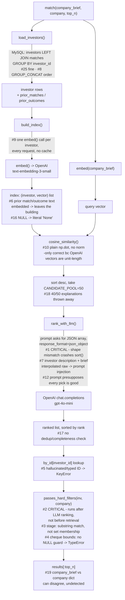

# matching_service.py — architecture

Request flow through `match()`, annotated with the `ai_review.md` finding numbers that
sit at each stage. Renders natively on GitHub.

## What the diagram doesn't show

No error handling / timeout / retry on any network call (#13), the DB connection leak on
exception (#14), the client constructed at import time from a required env var (#15), or
the fact none of this is logged (#27) — these aren't stages in the flow, they're the
absence of guardrails around every stage above.

## Reading order for triage

`#1` and `#2` sit directly on the path every request takes — `#1` crashes it outright,
`#2` means the 50-candidate pool is already wrong before the LLM sees it. `#6` and `#7`
are the two where the failure mode isn't a crash but the system quietly doing the wrong
thing at scale (leaking match data outward, taking instructions from investor-controlled
text). That ordering is the basis for the Case 2 Q1 answer (which three ship first).
